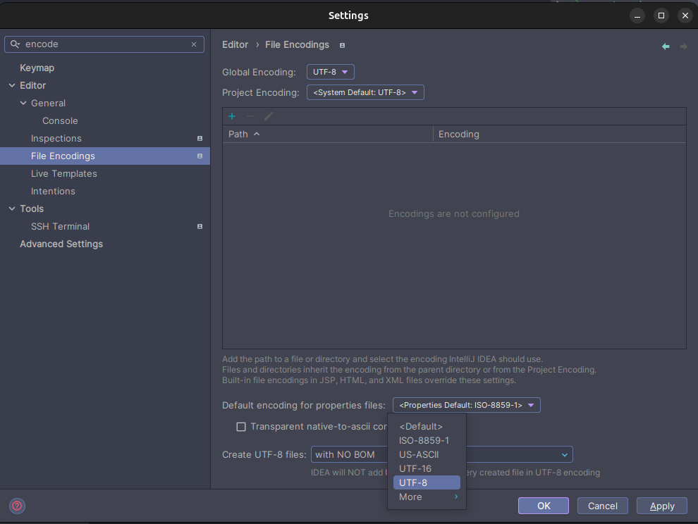

# Tài liệu hướng dẫn dự án Cloud HRM

| **Dự Án**              |                       | 
|------------------------|-----------------------|
| **Người tạo**          | Trần Thiện Quốc Anh   | 
| **Version**            | 2.6                   | 
| **Ngày tạo**           | 18/12/2024            | 
| **Chỉnh sửa lần cuối** | 25/12/2024            | 

> - Nếu là lần đầu run code, cần thực hiện bước [build JAR common service](#build-jar-common)

## Mục lục
* [I. Thông tin tổng quan](#i)
* [II. Yêu cầu môi trường](#ii)
* [III. Khởi chạy dự án](#iii)
* [IV. Cấu trúc dự án](#iv)
* [V. Tạo mới một micro service](#v)
    * [1. Khởi tạo module mới](#v.1)
    * [2. Các thư viện cần install](#v.2)
    * [3. Cấu hình service connect đến Eureka server](#v.3)
    * [4. Cấu hình Swagger làm API docs](#v.4)
    * [5. Cấu hình common service](#v.5)
    * [6. Cấu hình gateway](#v.6)
* [VI. Coding rules](#vi)
  * [1. Quy tắc đặt tên](#vi.1)
  * [2. Cấu trúc code](#vi.2)
  * [3. Quy tắc API và Response](#vi.3)
    * [3. URL Endpoint](#vi.3.1)
    * [3. Quy tắc Response](#vi.3.2)
      * [3. Các hàm hỗ trợ Base Response](#vi.3.2.1)
      * [3. Cấu trúc JSON](#vi.3.2.2)
* [VII. Đa ngôn ngữ](#vii)
  * [1. Cấu hình IDE](#vii.1)
  * [2. Cấu hình file dịch](#vii.2)
  * [3. Sử dụng đa ngôn ngữ](#vii.3)
* [Các lỗi thường gặp](#bugs)
  * [1. Ảnh trong README không hiển thị](#bugs.1)
  * [2. @ComponentScan báo lỗi Syntax](#bugs.2)

# I. Thông tin tổng quan <span id="i"></span>

- **Tên dự án:** Cloud HRM.
- **Đối tượng sử dụng:** Khách hàng của Gojob (phần lớn từ Talent Fusion).
- **Công nghệ sử dụng:** Java Spring Boot, MySQL.

# II. Yêu cầu môi trường <span id="ii"></span>

- **Java:** Version 21+.
- **Database**: MySQL.

Kiểm tra cấu hình CSDL file `application.yml` trong từng micro services

```yaml
spring:
  datasource:
    url: jdbc:mysql://<your-server-ip>:3306/hrm-local   # Thay thế <your-server-ip> bằng IP server
    username: root                                      # Thay thế user root bằng account đến CSDL
    password: abc@12345                                 # Nhập password truy cập CSDL
    driver-class-name: com.mysql.cj.jdbc.Driver
  jpa:
    hibernate:
      ddl-auto: update
    show-sql: true

```

# III. Khởi chạy dự án  <span id="iii"></span>

### Cách 1: Tự động cài thư viện hỗ trợ bằng IntelliJ IDEA

- Sử dụng IntelliJ IDEA mở thư mục gốc `gojob-hrm` và để IDE tự động xử lý các thư viện trong gradle.
- Vào Services và chọn Add service -> Run Configuration -> Spring Boot.  

  

- Khi thấy các service đã nhận đầy đủ có thể bấm run để khởi chạy dự án.
>**Lưu ý không tick chọn CommonServicesApplication**


#### Trường hợp có service chưa nhận đủ, cần chạy bằng tay service đó lần đầu để IDE tự index đến.

### Cách 2: Manual installation

- Vào từng service và install thư viện, ví dụ

```bash
cd account-service
./gradlew build
```

- Khởi chạy các service

```bash
./gradlew bootRun
```

# IV. Cấu trúc dự án <span id="iv"></span>

### 1. Cấu trúc thư mục
```
api-cloud-hrm
├── name_service/                       # Micro Service module
│   ├── config/                         # File cấu hình (Đa ngôn ngữ, JWT, Security, etc.)
│   ├── controller/                     # Xử lý HTTP request (API endpoints)
│   ├── model/                          # Entity mapping với database
│   ├── repository/                     # Giao tiếp với database
│   ├── service/                        # Business logic
│   ├── payload/                        # Định nghĩa DTO cho Request/Response
│       ├── request
│       └── response
│   ├── Application.java                # Entry point của service
│   └── resources/
│       └── application.yml             # Config file cho service
├── eureka_server/                      # Service registry (Eureka)
├── gateway_service/                    # API Gateway (Routing, Security)
```

### 2. Code mẫu CRUD

# V. Tạo mới một micro service <span id="v"></span>

### 1. Khởi tạo module mới trong dự án `File -> New -> Module` <span id="v.1"></span>  


#### Chú ý các thiết lập sau:

```yaml
Generator: Spring Boot
Language: Java
Type: Gradle - Groovy
Group: com.company.gojob
Package name: com.company.gojob.<name>_service # name là tên của service
JDK: 21+
Packaging: War
```


### 2. Các thư viện cần install <span id="v.2"></span>

```yaml
Lombok
Spring Data JPA
Spring Web
Validation
Eureka Discovery Client
MySQL Driver
```


#### Lưu ý:

> Trên đây chỉ là các thư viện cần thiết cho một service.
> Nếu đặc thù tính năng cần thêm thư viện ngoài thì có thể cài đặt thêm thông qua `build.gradle` của service đó (tham
> khảo phần setup Swagger).

### 3. Cấu hình service connect đến Eureka server <span id="v.3"></span>

Tại resources, tìm đến file: `application.yml`

```yaml
# Mục này xem tham khảo, cuối phần sẽ có full cấu hình `application.yml`.
spring:
  application:
    name: DEMO-SERVICE
  server:
    port: 9002  # Cần kiểm tra tránh trùng port giữa các service với nhau
  eureka:
    client:
      service-url:
        defaultZone: http://localhost:8761/eureka
      instance:
        hostname: localhost
        instance-id: ${spring.application.name}:${server.port}
        home-page-url: http://localhost:${server.port}/swagger-ui/index.html
        status-page-url: http://localhost:${server.port}/swagger-ui/index.html
        metadata-map:
          swagger-ui: http://localhost:${server.port}/swagger-ui/index.html
```

### 4. Cấu hình Swagger làm API docs cho dự án <span id="v.4"></span>

Tại `build.gradle`, thêm 2 config tại `dependencies` và nhấn sync

```groovy
implementation group: 'org.springdoc', name: 'springdoc-openapi-starter-webmvc-ui', version: '2.7.0'
implementation group: 'org.springdoc', name: 'springdoc-openapi-ui', version: '1.8.0'
```

Thêm config url đến swagger ở `application.yml`:

```yaml
# Mục này xem tham khảo, cuối phần sẽ có full cấu hình `application.yml`.
springdoc:
  api-docs:
    path: /v3/api-docs
  swagger-ui:
    path: /swagger-ui.html
    operationsSorter: method
```

Tạo file `SwaggerConfig` trong thư mục `config`
```java
@Configuration
public class SwaggerConfig {
    @Bean
    public OpenAPI customOpenAPI() {
        return new OpenAPI()
                .info(new Info()
                        .title("API Documentation")
                        .description("API cho phép quản lý tài khoản")
                        .version("1.0"))
                .components(new Components()
                        .addSecuritySchemes("JWT", new SecurityScheme()
                                .type(SecurityScheme.Type.HTTP) // Sử dụng HTTP
                                .scheme("bearer") // Sử dụng Bearer Authentication
                                .bearerFormat("JWT") // Format của token
                                .in(SecurityScheme.In.HEADER) // Thêm vào Header
                                .name("Authorization")) // Tên của Authorization header
                )
                .addSecurityItem(new io.swagger.v3.oas.models.security.SecurityRequirement()
                        .addList("JWT")); // Yêu cầu phải có Bearer Token cho các API
    }
}
```

Thêm annotation tại `DemoServiceApplication.java`
```java
@SpringBootApplication
@EnableDiscoveryClient
public class AccountServiceApplication {
}
```
>**Lưu ý:** Kiểm tra lại config đến CSDL theo hướng dẫn [ở phần này](#ii)

Chạy EurekaServer và DemoServiceApplication sau đó truy cập:  
http://localhost:8761/


Demo-service đã connect được tới server, thử truy cập swagger:  
http://localhost:9002/swagger-ui.html


> Swagger đã cấu hình thành công!

### Nội dung đầy đủ file `application.yml`
```yaml
spring:
  application:
    name: DEMO-SERVICE

  # Connect MySQL
  datasource:
    url: jdbc:mysql://<your-server-ip>:3306/hrm-local
    username: root
    password:
    driver-class-name: com.mysql.cj.jdbc.Driver
  jpa:
    hibernate:
      ddl-auto: update
    show-sql: true
server:
  port: 9001 # Kiểm tra trùng port

# Connect Eureka Server
eureka:
  client:
    service-url:
      defaultZone: http://localhost:8761/eureka/
  instance:
    hostname: localhost
    instance-id: ${spring.application.name}:${server.port}
    home-page-url: http://localhost:${server.port}/swagger-ui/index.html
    status-page-url: http://localhost:${server.port}/swagger-ui/index.html
    metadata-map:
      swagger-ui: http://localhost:${server.port}/swagger-ui/index.html

# Swagger UI
springdoc:
  api-docs:
    path: /v3/api-docs
  swagger-ui:
    path: /swagger-ui.html
    operationsSorter: method

management:
  endpoints:
    web:
      exposure:
        include: health,info
```

### Cấu hình common service <span id="v.5"></span>
**Mục đích:** Common là các thành phần dùng chung trong dự án (response, exception) đã được cấu hình sẵn và yêu cầu sử dụng ở tất cả các microservice.  

Mở công cụ hỗ trợ Gradle và add common-service vào (nếu chưa thấy trong danh sách)  
  
  
<span id="build-jar-common">Thực hiện build jar cho common-service (nếu là lần đầu run code, chưa build trước đó)</span>  
  

Truy cập lại `build.gradle` của service vừa tạo *(demo-service)* và tìm đến `repositories`, thêm dòng:
```groovy
repositories {
  mavenCentral()
  flatDir {
    dirs '../common-service/build/libs'
  }
}
```
Tại `dependencies`, thêm dòng:
```groovy
implementation name: 'common-service-0.0.1-SNAPSHOT-plain'
```

Tại `DemoServiceApplication`, thêm annotation
```java
@SpringBootApplication
@EnableDiscoveryClient
@ComponentScan(basePackages = {"com.company.gojob.demo_service","com.company.gojob.common_service"})
public class DemoServiceApplication {
  public static void main(String[] args) {
    SpringApplication.run(DemoServiceApplication.class, args);
  }
}
```

Sử dụng BaseResponse trong Controller
```java
import com.company.gojob.common_service.payload.response.BaseResponse;

@GetMapping("test-response")
public ResponseEntity<?> testResponse() {
  return BaseResponse.success();
}

@GetMapping("/list-user")
public ResponseEntity<?> getListUsers(
        @RequestParam(value = "pageIndex", defaultValue = "1") int page,
        @RequestParam(value = "pageSize", defaultValue = "10") int pageSize
) {
    Pageable pageable = PageRequest.of(page, pageSize);
    Page<UserCredential> users = userCredentialService.getListUsers(pageable);
    return BaseResponse.paginate(users);
}
```

Throw Exception:
```java
throw new EntityNotFoundException();
throw new Exception();
//...
```

### Cấu hình common gateway <span id="v.6"></span>
Truy cập `gateway-service`, thêm demo-service vào `application.yml` tại `cloud -> gateway -> routes`
```yaml
- id: DEMO-SERVICE
  uri: http://localhost:9001 # port của service
  predicates:
    - Path=/api/v1/demo/**
  filters:
  - AuthFilter
```

# VI. Coding rules <span id="vi"></span>

## 1. Quy tắc đặt tên <span id="vi.1"></span>

### 1.1 Package và Folder

- Tên package viết thường, sử dụng dấu chấm để phân cấp, service đặt theo quy tắc name_service  
  **Ví dụ:** `com.company.gojob.account_service`
- Các folder như `controller`, `service`, `repository`, `payload`, `model` phải giữ nguyên tên.

### 1.2 Class và Interface

- Tên class dùng PascalCase.  
  **Ví dụ:** `AccountController`, `UserServiceImpl`
- Interface bắt đầu bằng `I`.    
  **Ví dụ:** `IUserService`

### 1.3 Biến và Hàm

- Tên biến và hàm dùng camelCase, phải có ý nghĩa.  
  **Ví dụ:**
  ```java
  String userName;
  
  public void getUserDetails() {}
  ```
- Đặt prefix `is`, `has`, `can` cho boolean.  
  **Ví dụ:** `isActive`, `hasPermission`.

### 1.4 DTO và Model

- Model cần extends từ `BaseModel` của common-service (trừ bảng liên kết n-n)
  ```java
  @EqualsAndHashCode(callSuper = true)
  @Data
  @NoArgsConstructor
  @AllArgsConstructor
  @Entity
  @Table(name = "products")
  public class ProductModel extends BaseModel {
      // Không cần id, createdAt,... vì đã có sẵn trong BaseModel
      @Column(name = "name")
      private String name;
      
      @Column(name = "tax_price")
      private double taxPrice;
  }
  ```
- DTO cho request/response được đặt trong thư mục payload tương ứng.
- Tên DTO kết thúc bằng `DTO`.  
  **Ví dụ:** `CreateAccountRequestDTO`, `CategoryResponseDTO`
- Tên Entity (Model) dạng PascalCase, có hậu tố Model.  
  **Ví dụ:** `UserModel`, `ProductModel`.
- **Tuyệt đối không return về model, yêu cầu phải convert sang DTO để tránh chỉnh sửa response trên model.**
- (Không bắt buộc) constructor convert từ Model sang DTO (đối với DTO response):
  ```java
  public class UserModel {
      private String id;
      private String userName;
      private String password;
      //...
  }
  
  public class UserResponseDTO {
      private String id;
      private String userName;
      
      public UserResponseDTO(UserModel model) {
          this.id = model.id;
          this.userName = model.userName;
      }
  }
  
  // service return DTO
  public UserResponseDTO getUser(String userId) {
      UserModel user = this.userRepository.findById(userId);
      return new UserResponseDTO(user);
  }
  ```
- (Không bắt buộc) hàm toModel() để convert từ DTO sang Model (đối với DTO request):
  ```java
  public class ProductModel {
      private String id;
      private String name;
      private double price;
      //...
  }
  
  public class CreateProductRequestDTO {
      private String name;
      private double price;
      //...
    
      public ProductModel toModel() {
          ProductModel productModel = new ProductModel();
          productModel.name = this.name;
          productModel.price = this.price;
          //...
          return productModel;
      }
  }
  ```


## 2. Cấu trúc code <span id="vi.2"></span>

### 2.1 Controller

- Tên Controller theo format: `[TênService]Controller`.  
  **Ví dụ:** `AccountController`
- Chỉ xử lý HTTP request và response, không chứa logic phức tạp.
- Controller return về BaseResponse tương ứng với yêu cầu dữ liệu (success, pagination, error)
- Gắn annotation rõ ràng:
  ```java
  @RestController
  public class AccountController {
    // Code
  }
  ```

### 2.2 Service

- Interface Service đặt tên dạng `[Tên]Service`.  
  **Ví dụ:** `UserService`, `ProductService`.
- Implement đặt tên dạng `[Tên]ServiceImpl`.  
  **Ví dụ:** `UserServiceImpl`.
- Service chứa các logic nghiệp vụ và gọi đến repository để lấy/chỉnh sửa dữ liệu.
- Service cần trả về kết quả để controller convert sang chuẩn response gửi về Frontend.
- Exception phải throw trong service để handling chuẩn response có thể trả về cho Frontend.

### 2.3 Repository

- Tên Repository theo format `[Entity]Repository`.  
  **Ví dụ:** `UserRepository`.
- Sử dụng `JpaRepository` hoặc `CrudRepository`.

## 3. Quy tắc API và Response <span id="vi.3"></span>

### 3.1 URL Endpoint <span id="vi.3.1"></span>

- Endpoint viết thường, sử dụng dấu gạch ngang `-`.  
  **Ví dụ:** `/get-list-user`.
- Tên HTTP method phải rõ ràng:
    - `GET` cho lấy dữ liệu.
    - `POST` cho tạo mới.
    - `PUT` cho cập nhật.
    - `DELETE` cho xóa.
- API GET chi tiết, UPDATE thông tin và DELETE: thêm hậu tố `{id}` vào endpoint.  
  **Ví dụ:**
  - GET: `/user/{id}`
  - PUT: `/user/{id}`
  - DELETE: `/user/{id}`
  
### 3.2 Quy tắc Response <span id="vi.3.2"></span>

#### 3.2.1. Các hàm hỗ trợ Base Response <span id="vi.3.2.1"></span>

| **Tên hàm**                        | Tham số                                                 | Ý nghĩa                                                                    |
|------------------------------------|---------------------------------------------------------|----------------------------------------------------------------------------|
| success()                          | Không                                                   | Trả về success với message mặc định                                        |
| success(message)                   | message                                                 | Trả về success với message, mặc định data, extraData null                  |
| success(message, data)             | message: String, data: Object                           | Trả về success với message, data, mặc định extraData null                  |
| success(message, data, extraData)  | message: String, data: Object, extraData: Object        | Trả về success với message, data và extraData                              |
| error()                            | Không                                                   | Trả về lỗi với 500                                                         |
| error(message)                     | message: String                                         | Trả về lỗi với message, statusCode mặc định 500                            |
| error(message, status)             | message: String, status: HttpStatus                     | Trả về lỗi với message, statusCode tùy chỉnh                               |
| error(message, devMessage, status) | message: String, devMessage: String, status: HttpStatus | Trả về lỗi với message, devMessage là StackTrace lỗi, statusCode tùy chỉnh |
| paginate(page)                     | page: Page                                              | Trả về dữ liệu phân trang bằng Pageable với data                           |
| paginate(page, message)            | page: Page, message: String                             | Trả về dữ liệu phân trang bằng Pageable với data và message                |
| paginate(page, message, extraData) | page: Page, message: String, extraData: Object          | Trả về dữ liệu phân trang bằng Pageable với data, message và extraData     |

#### Sử dụng:
```java
public ResponseEntity<?> successA() {
    return BaseResponse.success();
}

public ResponseEntity<?> successB() {
    return BaseResponse.success("Thao tác thành công");
}

public ResponseEntity<?> successC() {
    boolean isSuccess = this.service.doingSomething();
    if (isSuccess) {
        return BaseResponse.success("Thao tác thành công");
    }
    // Bước error này có thể không cần nếu throw lỗi trong service
    // Source base đã cấu hình handling exception trả về đúng định dạng error 
    return BaseResponse.error("Có lỗi xảy ra");
}
//...
```

#### 3.2.2. Cấu trúc JSON <span id="vi.3.2.2"></span>

**Success:** (200)

```js
response = 
{
  "success": true,
  "message": "Operation completed",
  "data": {},
  "extraData": {} // nếu cần, được phép null
}
```

**Success có phân trang:** (200)

```js
response = 
{
  "success": true,
  "message": "Operation completed",
  "data": {},
  "extraData": {}, // nếu cần, được phép null
  "paginate": {
    "totalRecords": 100, // tổng số records trong database
    "totalPages": 10, // tổng số trang
    "pageIndex": 1, // trang hiện tại
    "pageSize": 10 // số records mỗi trang
  }
}
```

**Unknown Error:** (500)

```js
error =
{
  "success": false,
  "message": "An error has occurred",
  "devMessage": "java.lang.ArithmeticException...", // Trả StackTrace lỗi được throw để dev có thể check và nhận diện lỗi
  "data": null
}
```

**Validation Error:** (422)

```json
{
  "success": false,
  "message": {
    "email": [
      "The emails must be a valid emails format."
    ],
    "password": [
      "Password must be at least 8 characters"
    ]
  },
  "data": null
}
```

**NotFound Error:** (404)

```json
{
  "success": false,
  "message": "Not Found. The requested resource could not be found.",
  "data": null
}
```

**Unauthorized Error:** (401)

```json
{
  "success": false,
  "message": "Unauthorized. Access is denied due to invalid credentials.",
  "data": null
}
```

**Forbidden Error:** (403)

```json
{
  "success": false,
  "message": "Forbidden. You do not have permission to access this resource.",
  "data": null
}
```

# VII. Đa ngôn ngữ <span id="vii"></span>
### 1. Cấu hình IDE <span id="vii.1"></span>

Đảm bảo UTF-8 được thiết lập  


### 2. Cấu hình file dịch <span id="vii.2"></span>
Tạo mới 2 files cấu hình đa ngôn ngữ trong thư mục `src/main/resources`:

`messages_en.properties`
```properties
error.not-found=Not Found
```

`messages_vi.properties`
```properties
error.not-found=Không tìm thấy
```

### 3. Sử dụng <span id="vii.3"></span>

```java
// Trả về String
String translate = Trans.getMessage("error.not-found");
// Với base response
return BaseResponse.error(Trans.getMessage("error.not-found"));
```

Với message có tham số truyền vào  

`messages_en.properties`
```properties
error.missing-request-parameter=Missing request parameter: {0}
```

`messages_vi.properties`
```properties
error.missing-request-parameter=Thiếu tham số yêu cầu: {0}
```

```java
// output:
// en: Missing request parameter: id
// vi: Thiếu tham số yêu cầu: id
Trans.getMessage(
        "error.missing-request-parameter",
        new Object[]{"id"}
)
```

# Các lỗi thường gặp <span id="bugs"></span>
### 1. Ảnh trong README không hiển thị <span id="bugs.1"></span>
*(Author: Khương)*  
- B1: Vào `File -> Close project`, xóa thư mục `.idea` và thực hiện mở lại source code.  
- B2: Vào `File -> Project Stucture -> Modules` và import lại `eureka-server`. Sau đó dùng công cụ gradle để import lại các service con cần sử dụng

> Hoặc load lại bằng công cụ hỗ trợ của Jetbrains


### 2. @ComponentScan báo lỗi Syntax
*(Author: Khương)*  
```java
@ComponentScan(basePackages = {"com.company.gojob.<name>_service", "com.company.gojob.common_service"})
public class DemoServiceApplication {}
```
- Kiểm tra `<name>_service` đã đúng với package name chưa.
- Kiểm tra lại `common-service` đã được build jar chưa.
- Xóa `@ComponentScan` cùng với phần import và gõ lại.
- Lưu ý import từ `org.springframework.context.annotation.ComponentScan;`
